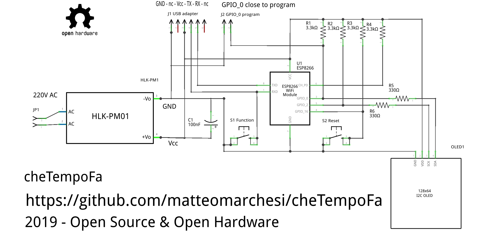

# cheTempoFa

Weather gadged based on ESP8266 ESP-01.

*Files*
cheTempoFa.ino
- dateTimeFunct.ino
- displayFunct.ino
- weatherFunct.ino
 
#Hardware:
- 1x ESP-01
- 1x SSD1306 0.96" dispaly 128x64 monchrome
- 4x 3.3K pullup resistors
- 2x 330R pass resistor
- 2x pushbuttons
  - reset (hidden in the case)
  - function
- program switch (jumper hidden in the case)
- USB adapter for program/debugging (to be removed in the case)

*Schematic:*
 
#Software:
Get date and time from NTP server
Auto DST for Europe.
Get weather from openweathermap.org
- current
- 3x 3h forecast
- next 3 days forecast
- OTA (TBD)
- SPIFF (TBD) to manage config parameters (TBD)
  - ssid
  - password
  - apikey
  - location

**REQUIRES** ArduinoJSON 6
AdafruitGFX

in Adafruit_SSD1306.h set the 128x64 configuration!!!
	#define SSD1306_128_64
	//   #define SSD1306_128_32

